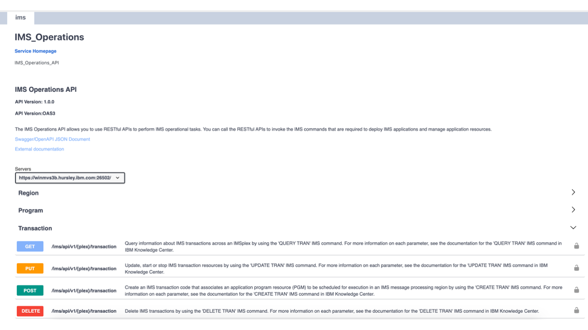

# IMS Operations API

- [Downloading IMS Operations API](#downloading-ims-operations-api)
- [Configuring the IMS Operations API as a Zowe component](#configuring-the-ims-operations-api-as-a-zowe-component)
- [Using the IMS Operations API](#using-the-ims-operations-api)

## Downloading IMS Operations API

Download the pax file `zowe-ims-ops-api-1.0.0.pax`.  This is available in github at https://github.com/zowe/ims-operations-api/blob/master/build/ims-ops-api-1.0.0.pax.

The next step is to transfer the pax file from your PC to a z/OS USS directory where Zowe has already been installed.  

If you are using file transfer protocol (ftp) you should set binary transfer mode with the `bin` command.  If you fail to set the `bin` command the pax file will be converted as though it was a text file and will become unusable on z/OS.  If you are using secure file transfer protocol (sftp) to transfer between your PC to z/OS this always uses binary transfer mode so there is no possibility of an accidental unwanted text conversion occurring.  

```
ftp <userID@ip.of.zos.box>
Password for userID@ip.of.zos.box ********
ftp>bin
Binary transfer mode selected
ftp>put ims-ops-api-1.0.0.pax
Uploading ims-ops-api-1.0.0.pax to /u/winchj/ims-ops-api-1.0.0.pax
ims-ops-api-1.0.0.pax                         100%   41MB   1.7MB/s   00:24    
```

Once the `ims-ops-api-1.0.0.pax` is on USS it needs to be expanded.  To do this log onto USS using ssh, or ishell, or OMVS.  Navigate to the directory where the pax file was transferred to and issue the pax command to expand its contents.

```
pax -ppx -rf ims-ops-api-1.0.0.pax
```

Having expanded the pax file you will see the following files

```
ims-ops-api-1.0.0.jar
zowe-scripts/
  start.sh
  configure.sh
  validate.sh
```

The `ims-ops-api-1.0.0.jar` file contains the Java code for the Spring Boot server that uses the API Mediation Layer dynamic registration pattern to add the IMS Operations API.  For more information on Spring Boot services registering with the API Mediation Layer see, [Configuring your Spring Boo based service to onboard with API ML](https://docs.zowe.org/stable/extend/extend-apiml/onboard-spring-boot-enabler.html#outline-of-onboarding-a-rest-service-using-spring-boot).

The three scripts are part of the lifecycle pattern that allows a Zowe extension to register itself as an external component to a Zowe instance.  For more information on lifecycling Zowe extensions see [Zowe lifecycle](https://docs.zowe.org/stable/extend/lifecycling-with-zwesvstc.html#zowe-components).

The Zowe started task `ZWESVSTC` runs under the user ID `ZWESVUSR` and needs to be able to access these files. To see the permissions use the unix command `ls -alT`.  **Note** The dates and sizes of the actual files may be different, and the USERID will be the userID that was used to do the transfer, and the group TSOUSER may be different.  

```
>ls -alT
- untagged  T=off -rw-------    1 USERID     TSOUSER     262144    Jul 10 12:09 ims-ops-api-1.0.0.jar
- untagged  T=off drw-------    1 USERID     TSOUSER       8192    Jul 10 12:09 zowe-scripts
```

The file permissions of `rw-------` only give the owner read (and write) access, so the user ID `ZWESVUSR` will be unable to open the files.  To grant `ZWESVUSR` permission allow all users the ability to read the .jar file, and all users the ability to read and execute the directory.  (Execute permission is required for the directory as this is needed to expand directory contents).

```
>chmod a+r ims-ops-api-1.0.0.jar
>chmod a+rw zowe-scripts
```

The permissions should now have been set correctly, and you can check this using `ls -alT`.

```
>ls -alT
- untagged  T=off -rw-r--r--    1 USERID     TSOUSER     262144    Jul 10 12:09 ims-ops-api-1.0.0.jar
- untagged  T=off drw-r-xr-x    1 USERID     TSOUSER       8192    Jul 10 12:09 zowe-scripts
```

The next step is to configure a Zowe instance to point to the IMS Operations API directory so that is recognized as an external component.

## Configuring the IMS Operations API as a Zowe component

A Zowe started task `ZWESVSTC` is launched from an instance directory that contains configuration information such as which Zowe runtime to use, as well as any Zowe extensions to include.  

### Update the Zowe instance

To configure Zowe to use the IMS Operations API the instance directory file `instance.env` in the instance directory used to launch Zowe needs to be updated so  the `EXTERNAL_COMPONENTS` value points to the `zowe-scripts` directory created earlier.

For example, if you expanded into `/usr/lpp/zowe-extensions/ims` then the `EXTERNAL_COMPONENTS` would point to `usr/lpp/zowe-extensions/ims/zowe-scripts`.

```sh
EXTERNAL_COMPONENTS=/usr/lpp/zowe-extensions/ims/zowe-scripts # For third-party extender to add the full path to the directory containing their component lifecycle scripts
```

If the `instance.env` file has more than one `EXTERNAL_COMPONENTS` path because you have more than one extension component then semi colons `;` should be used to separate the paths. 

### Set the port

The IMS Operations API is a Java Spring Boot server that will be started by the Zowe started task `ZWESVSTC`.  The server needs to use a port that it uses to receive REST API requests from the API gateway.  The value of this port is held in the file `configure.sh` in the variable `ZWE_IMS_OPS_API_PORT`.

```sh
# This is the port that the Springboot server that provides the IMS Operations API will listen on
export ZWE_IMS_OPS_API_PORT=26510
```
The default value of the port is 26510.  You should update this port if required to use a different value depending on your z/OS environment.  

## Using the IMS Operations API

When you launch Zowe the started task `ZWESVSTC` will open a number of address spaces.  These are named to allow you to distinguish them in RMF records or SDSF views.  For more information see [Address space names](https://docs.zowe.org/stable/user-guide/configure-instance-directory.html#address-space-names).

The IMS Operations API address space will be given a subcomponent value of `IM`, so its name will be `ZWE1IM`.  The address space will be started and stopped with Zowe.

### API Catalog

When you log onto the API Catalog the IMS Operations API will appear as a tile.  If it is not there check the `STDERR` file for the `ZWESVSTC` started task for any messages.  

 

Selecting the IMS Operations API tile will allow you to browser the available APIs as well as test them.  For more information see [Using the IMS Operations API](./using-ims-operations-api.md)

 


<!--
pax -wvf ims-ops-api-1.0.0.pax .
pax -ppx -rf ims-ops-api-1.0.0.pax
-->